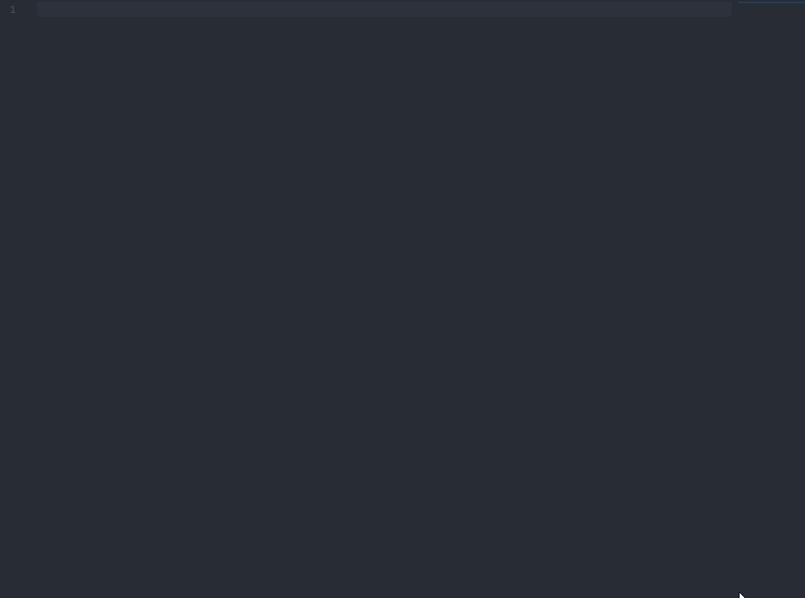
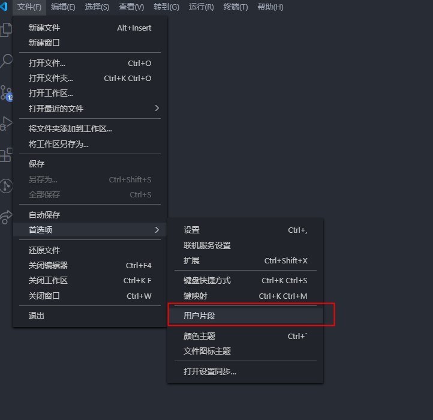
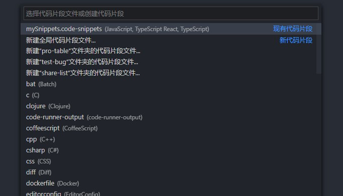
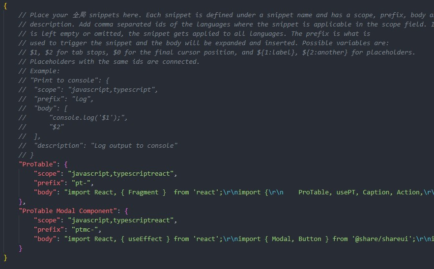
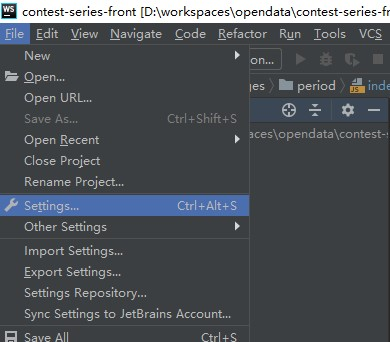
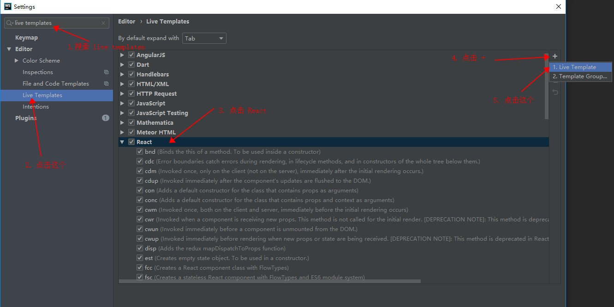
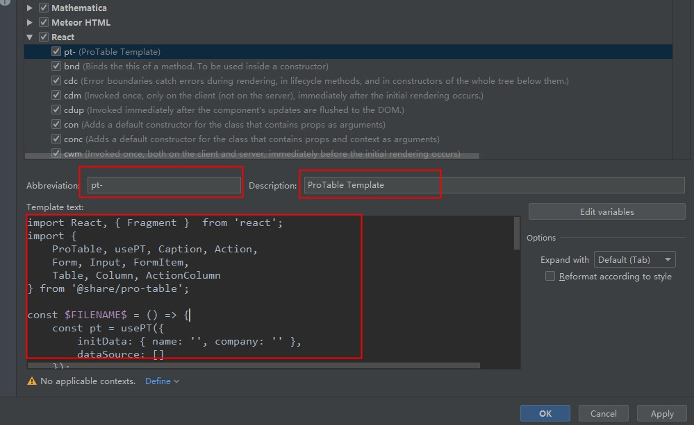
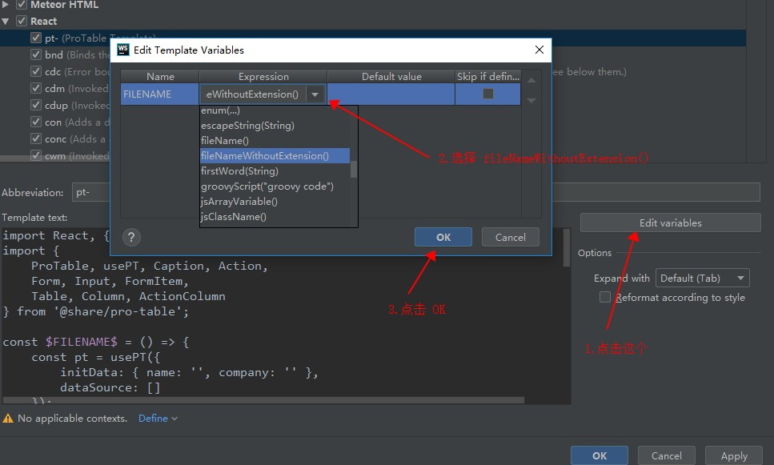
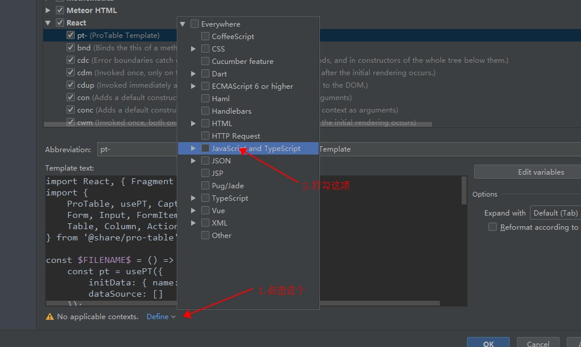
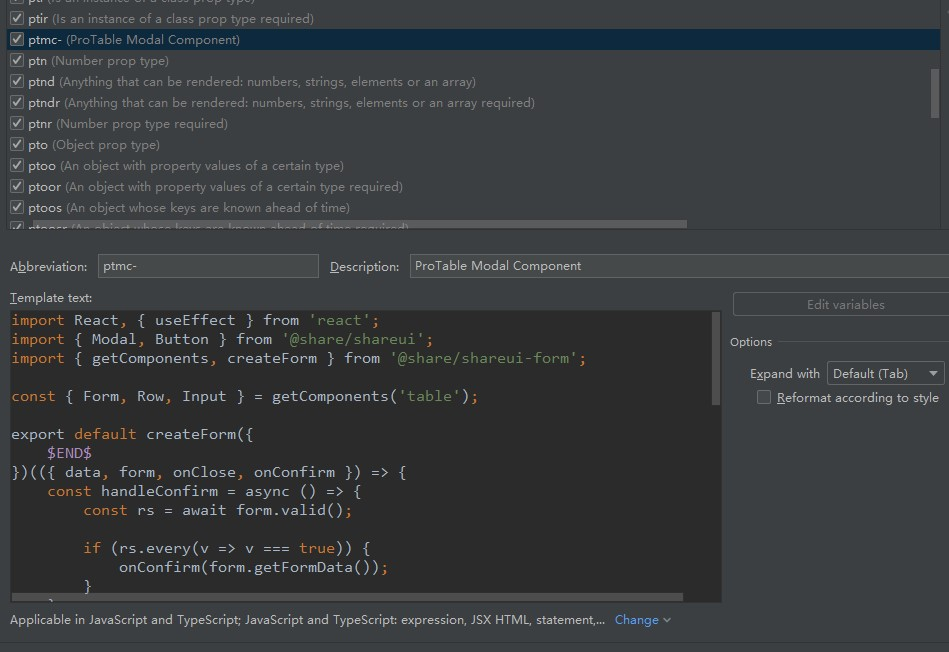

# 代码模板配置

效果演示



## VSCode

### 第一步

点击 `文件` -> `首选项` -> `用户片段`



### 第二步



如果原先没有设置过，就点击 “新建全局片段文件...” ，填写完名字按下回车建。

如果之前有设置过，就直接点击之前的。

### 第三步



```json
"ProTable": {
    "scope": "javascript,typescriptreact",
    "prefix": "pt-",
    "body": "import React, { Fragment }  from 'react';\r\nimport {\r\n    ProTable, usePT, Caption, Action,\r\n    Form, Input, FormItem,\r\n    Table, Column, ActionColumn\r\n} from '@share/pro-table';\r\n\r\nconst $TM_FILENAME_BASE = () => {\r\n    const pt = usePT({\r\n        initData: { name: '', company: '' },\r\n        dataSource: []\r\n    });\r\n\r\n    return (\r\n        <ProTable {...pt}>\r\n            <Form>\r\n                <Input label=\"\" field=\"\" />\r\n                <FormItem>\r\n                    <Action.Query />\r\n                    <Action.Reset />\r\n                </FormItem>\r\n            </Form>\r\n            <Caption>\r\n                <Caption.Title>标题</Caption.Title>\r\n                <Caption.Description>描述</Caption.Description>\r\n                <Caption.Extra>\r\n                    <Action.Button to=\"/add\">新增用户</Action.Button>\r\n                </Caption.Extra>\r\n            </Caption>\r\n            <Table>\r\n                <Column label=\"\" field=\"\" />\r\n                <ActionColumn>\r\n                    {(_, row) => (\r\n                        <Fragment>\r\n                            <Action to={`/edit?id=${row.id}`}>编辑</Action>\r\n                            <Action confirm onClick={() => row.id}>删除</Action>\r\n                        </Fragment>\r\n                    )}\r\n                </ActionColumn>\r\n            </Table>\r\n        </ProTable>\r\n    );\r\n};\r\n\r\nexport default $TM_FILENAME_BASE;\r\n"
},
"ProTable Modal Component": {
    "scope": "javascript,typescriptreact",
    "prefix": "ptmc-",
    "body": "import React, { useEffect } from 'react';\r\nimport { Modal, Button } from '@share/shareui';\r\nimport { getComponents, createForm } from '@share/shareui-form';\r\n\r\nconst { Form, Row, Input } = getComponents('table');\r\n\r\nexport default createForm({\r\n    $1\r\n})(({ data, form, onClose, onConfirm }) => {\r\n    const handleConfirm = async () => {\r\n        const rs = await form.valid();\r\n\r\n        if (rs.every(v => v === true)) {\r\n            onConfirm(form.getFormData());\r\n        }\r\n    };\r\n\r\n    useEffect(() => {\r\n        data && form.setFieldValues(data);\r\n    }, []); // eslint-disable-line\r\n\r\n    return (\r\n        <Modal show onHide={onClose}>\r\n            <Modal.Header closeButton>\r\n                <Modal.Title>{data ? '编辑' : '新建'}$2</Modal.Title>\r\n            </Modal.Header>\r\n            <Modal.Body full>\r\n                <Form formState={form}>\r\n                    <Row>\r\n                        <Input label=\"\" field=\"\" />\r\n                    </Row>\r\n                </Form>\r\n            </Modal.Body>\r\n            <Modal.Footer style={{ borderTop: 'none' }}>\r\n                <Button bsStyle=\"primary\" onClick={handleConfirm}>保存</Button>\r\n                <Button onClick={onClose}>取消</Button>\r\n            </Modal.Footer>\r\n        </Modal>\r\n    );\r\n});\r\n"
},
```

将以上代码复制到文件对应位置。

## IDEA 或 WebStorm

### 第一步

点击 `File` -> `Settings...`



### 第二步

1. 搜索 `live templates`
2. 点击 `Live Templates`
3. 点击 `React`
4. 点击右侧加号
5. 选择 `Live Template`



### 第三步

1. 输入 `Abbreviation` 值为 `pt-`
2. 输入 `Description` 值为 `ProTable Template`
3. 将以下代码复制进 `Template text` 里

```jsx
import React, { Fragment }  from 'react';
import {
    ProTable, usePT, Caption, Action,
    Form, Input, FormItem,
    Table, Column, ActionColumn
} from '@share/pro-table';

const $FILENAME$ = () => {
    const pt = usePT({
        initData: { name: '', company: '' },
        dataSource: []
    });

    return (
        <ProTable {...pt}>
            <Form>
                <Input label="" field="" />
                <FormItem>
                    <Action.Query />
                    <Action.Reset />
                </FormItem>
            </Form>
            <Caption>
                <Caption.Title>标题</Caption.Title>
                <Caption.Description>描述</Caption.Description>
                <Caption.Extra>
                    <Action.Button to="/add">新增用户</Action.Button>
                </Caption.Extra>
            </Caption>
            <Table>
                <Column label="" field="" />
                <ActionColumn>
                    {(_, row) => (
                        <Fragment>
                            <Action to={`/edit?id=${row.id}`}>编辑</Action>
                            <Action confirm onClick={() => row.id}>删除</Action>
                        </Fragment>
                    )}
                </ActionColumn>
            </Table>
        </ProTable>
    );
};

export default $FILENAME$;

```



### 第四步

1. 点击右侧的 `Edit variables`
2. 点击 `Expression` 选择 `fileNameWithoutExtension()`
3. 点击 `OK`



### 第五步

1. 点击底下的 `Define`
2. 勾选 `JavaScript and TypeScript`



### 第六步

同样的操作再创建一个 `ptmc-`，回到第二步，忽略第四步

`Template text` 内容是：

```jsx
import React, { useEffect } from 'react';
import { Modal, Button } from '@share/shareui';
import { getComponents, createForm } from '@share/shareui-form';

const { Form, Row, Input } = getComponents('table');

export default createForm({
    $END$
})(({ data, form, onClose, onConfirm }) => {
    const handleConfirm = async () => {
        const rs = await form.valid();

        if (rs.every(v => v === true)) {
            onConfirm(form.getFormData());
        }
    };

    useEffect(() => {
        data && form.setFieldValues(data);
    }, []); // eslint-disable-line

    return (
        <Modal show onHide={onClose}>
            <Modal.Header closeButton>
                <Modal.Title>{data ? '编辑' : '新建'}</Modal.Title>
            </Modal.Header>
            <Modal.Body full>
                <Form formState={form}>
                    <Row>
                        <Input label="" field="" />
                    </Row>
                </Form>
            </Modal.Body>
            <Modal.Footer style={{ borderTop: 'none' }}>
                <Button bsStyle="primary" onClick={handleConfirm}>保存</Button>
                <Button onClick={onClose}>取消</Button>
            </Modal.Footer>
        </Modal>
    );
});

```

