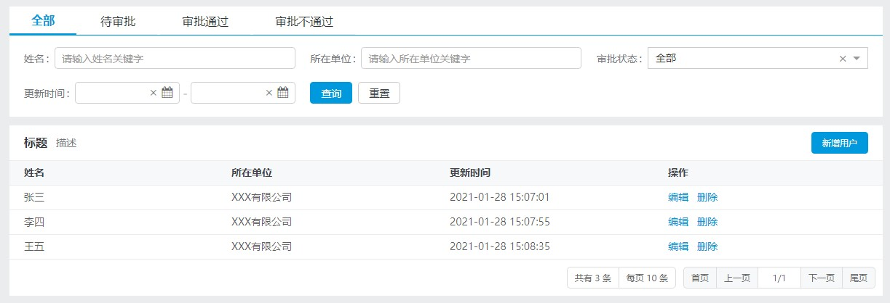

# 快速入门

## 安装

```sh
$ yarn add @share/pro-table
```

**注意：组件的依赖采取对等依赖的形式，需要注意下以下版本号**

确保项目模块依赖满足以下版本

- `react`: `>=16.8.x`
- `react-dom`: `>=16.8.x`
- `react-router-dom`: `>=5.x.x`
- `@share/form`: `>=2.x.x`
- `@share/list`: `>=1.x.x`
- `@share/shareui`: `>=2.27.x`
- `@share/shareui-html`: `>=2.25.x`

如果版本不满足，需要各自装下最新版。

为了能更快速的开发，推荐使用编译器的代码模板，模板配置请看 [代码模板配置文档](./code-template-config.md)

## 引入

```jsx
import { ProTable, usePT, Table, Column } from '@share/pro-table'
```

## 基本使用

```jsx
const pt = usePT({
    dataSource: []
});

<ProTable {...pt}>
    <Table>
        <Column label="姓名" field="name" />
        <Column label="所在单位" field="company" />
    </Table>
</ProTable>
```

## 完整示例

```jsx
import React, { Fragment }  from 'react';
import {
    ProTable, usePT, Caption, Action,
    Form, Input, FormItem, Select, CalendarRange,
    Table, Column, ActionColumn, Tabs
} from '@share/pro-table';

const tabsOptions = [
    { label: '全部', value: '' },
    { label: '待审批', value: '0' },
    { label: '审批通过', value: '1' },
    { label: '审批不通过', value: '2' },
];

const Demo = () => {
    const pt = usePT({
        tabsField: 'status',
        initData: {
            name: '',
            company: '',
            status: '',
            updatedTime: { start: '', end: '' }
        },
        mapField: {
            updatedTime: {
                start: 'updatedTimeBegin',
                end: 'updatedTimeEnd'
            }
        },
        dataSource: [
            { name: '张三', updatedTime: '2021-01-28 15:07:01', company: 'XXX有限公司' },
            { name: '李四', updatedTime: '2021-01-28 15:07:55', company: 'XXX有限公司' },
            { name: '王五', updatedTime: '2021-01-28 15:08:35', company: 'XXX有限公司' },
        ]
    });

    return (
        <ProTable {...pt}>
            <Tabs options={tabsOptions} />

            <Form>
                <Input label="姓名" field="name" />
                <Input label="所在单位" field="company" />
                <Select label="审批状态" field="status" options={tabsOptions} />
                <CalendarRange label="更新时间" field="updatedTime" />
                <FormItem>
                    <Action.Query />
                    <Action.Reset />
                </FormItem>
            </Form>

            <Caption>
                <Caption.Title>标题</Caption.Title>
                <Caption.Description>描述</Caption.Description>
                <Caption.Extra>
                    <Action.Button to="/add">新增用户</Action.Button>
                </Caption.Extra>
            </Caption>

            <Table>
                <Column label="姓名" field="name" />
                <Column label="所在单位" field="company" />
                <Column label="更新时间" field="updatedTime" />
                <ActionColumn>
                    {(_, row) => (
                        <Fragment>
                            <Action to={`/edit?id=${row.id}`}>编辑</Action>
                            <Action confirm onClick={() => row.id}>删除</Action>
                        </Fragment>
                    )}
                </ActionColumn>
            </Table>
        </ProTable>
    );
};
```


