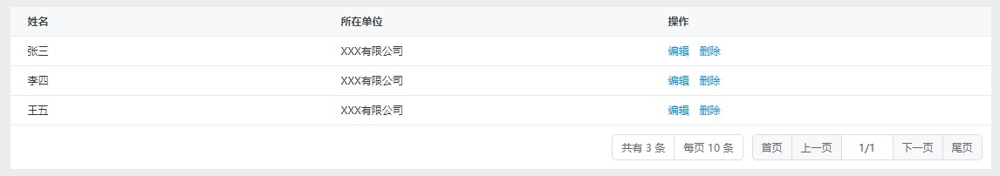
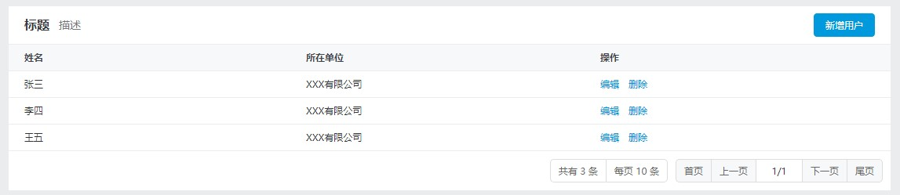

# 使用教程


## 开发流程说明

### 引入组件

所有组件都通过 `@share/pro-table` 直接获取：

```js
import { ProTable, usePT, Table, Column, Form, Input } from '@share/pro-table';
```

### 获取组件数据

组件所需数据都是通过 `usePT` （也可以使用全称 `useProTable` ）方法获取：

```js
const pt = usePT({
    initData: {},
    dataSource: findUserList,
    uniqKey: 'userId'
});
```

`usePT` 的接收的参数与 `@share/list` 的 `useList` 一样（具体请看 [useList 相关文档](http://192.168.0.62:4002/share-list/api.html#uselist)），在此之上做了一些扩展参数，常用的有 `initData`、[mapField](#mapField) ，其他的后续讲解都会讲到。

`initData` 作为组件的初始数据，包含表单初始值、表格初始值、标签初始值，共用一套数据。

- 表单初始值：即作为 `FormState` 的初始值传入
- 表格初始值：实际是将与表格的 `autoLoad` 属性里的 `requestData` 数据合并
- 标签初始值：标签数据将使用表单数据，通过传入 `tabsField` 来关联数据

针对 `useList` 的 `autoLoad` 做了调整，`autoLoad` 只能传 `true` 和 `false` ，默认为 `true` 。原本可传对象，现在拆分为 `initData` 、`initPage` 、`initSort` 属性，当 `autoLoad` 为 `true` 或不传时，将构建出一个对象传给 `useList` 的 `autoLoad`，例如：

```js
usePT({
    initData: { a: '1' },
    initPage: { currentPage: 2 },
    initSort: { order: '3' }
})
```

将会转为：

```js
useList({
    autoLoad: {
        requestData: { a: '1' },
        page: { currentPage: 2 },
        sort: { order: '3' }
    }
}
```

此操作是为了防止 `initData` 和 `autoLoad` 值的混淆，拆离 `initPage`、`initSort` 方便后续扩展。

### 外层组件使用

返回的 `pt` 变量存在 `<ProTable>` 所需的属性，需要将 `pt` 解构为组件属性：

```jsx
<ProTable {...pt}>
    ...
</ProTable>
```

`<ProTable>` 作为外层组件，所有其他组件都要在这里面写，例如：

```jsx
<ProTable {...pt}>
    {/* 标签 */}
    <Tabs />
    
    {/* 表单 */}
    <Form />
    
    {/* 表头 */}
    <Caption />
    
    {/* 表格 */}
    <Table />
</ProTable>
```

各个元素在 `<ProTable>` 里面可以随意组合，组件的位置就是页面渲染的位置。各个组件的功能在下面逐一讲解。

## 表格使用

### 基础用法

```jsx
import React, { Fragment }  from 'react';
import { ProTable, usePT, Table, Column, ActionColumn } from '@share/pro-table';

const Demo = () => {
    const pt = usePT({
        dataSource: [
            { name: '张三', company: 'XXX有限公司' },
            { name: '李四', company: 'XXX有限公司' },
            { name: '王五', company: 'XXX有限公司' },
        ]
    });

    return (
        <ProTable {...pt}>
            <Table>
                <Column label="姓名" field="name" />
                <Column label="所在单位" field="company" />
                <ActionColumn>
                    {(_, row) => (
                        <Fragment>
                            <a>编辑</a>
                            <a>删除</a>
                        </Fragment>
                    )}
                </ActionColumn>
            </Table>
        </ProTable>
    );
};
```



-  `<Table>` 是基于 `@share/list` 的 `<ShareList>` 做了一层封装，使用方式是一样的，具体请看 [ShareList 文档](http://192.168.0.62:4002/share-list/base.html) ，区别在于这边的 `listState` 可以传，也可以不传；
- `<Column>` 用法与 `@share/list` 的 `<Column>` 一样；
- `<ActionColumn>` 是在 `@share/list` 的 `<ActionColumn>` 基础上调整了样式，提供子元素传函数的支持；
- 除此之外，`@share/list` 提供的 `<NumberColumn>` 和 `<CheckColumn>`  也能从 `@share/pro-table` 里拿到。

### 带表头的用法

针对比较常用的表头信息，这边提供了一个 `<Caption>` 组件，基本用法如下：

```jsx
import React, { Fragment }  from 'react';
import { Button } from '@share/shareui';
import { ProTable, usePT, Table, Column, Caption } from '@share/pro-table';

const Demo = () => {
    const pt = usePT({
        dataSource: []
    });

    return (
        <ProTable {...pt}>
            <Caption>
            	<Caption.Title>标题</Caption.Title>
                <Caption.Description>描述</Caption.Description>
                <Caption.Extra>
                    <Button bsStyle="primary">新增用户</Button>
                </Caption.Extra>
            </Caption>
            <Table>
                <Column label="姓名" field="name" />
                <Column label="所在单位" field="company" />
            </Table>
        </ProTable>
    );
};
```



- `<Caption.Title>` 存放标题文本，即加粗 16 号黑色字体文本
- `<Caption.Description>` 存放描述文本，即 14 号灰色字体文本
- `<Caption.Extra>` 存放放在右侧的文本，按钮和 `<a>` 之间会带上 `8px` 边距样式

**注意：这三个组件渲染位置固定，不能随意改动位置**

### 带初始查询条件

在 `@share/list` 里设置初始查询条件，就要在 `useList` 里传 `autoLoad` 属性，例如：

```js
const list = useList({
    dataSource: [],
    autoLoad: {
        requestData: {
            name: 'test'
        }    
    }
});
```

但在 `ProTable` 里，如果你的初始查询条件是 `requestData` 里的，你就要改成到 `initData` 写，例如

```jsx
import React, { Fragment }  from 'react';
import { ProTable, usePT, Table, Column, Caption } from '@share/pro-table';

const Demo = () => {
    const pt = usePT({
        initData: { name: 'test' }
        dataSource: []
    });

    return (
        <ProTable {...pt}>
            <Table>
                <Column label="姓名" field="name" />
                <Column label="所在单位" field="company" />
            </Table>
        </ProTable>
    );
};
```

这边的 `initData` 是表格、表单、标签三块共享的数据，因为这三块是数据是要时刻保持一致的。

如果你的初始查询条件不是属于  `requestData` 里的，还是采用 `autoLoad` 的方式设置，最终的结果会跟 `initData` 合并。

### 兼容原生写法

不一定需要使用 `@shara/pro-table` 提供的组件，直接使用 `@share/list` 也没问题：

```jsx
import React, { Fragment }  from 'react';
import { ProTable, usePT, Table } from '@share/pro-table';
import { ShareList, Column } from '@share/list'

const Demo = () => {
    const pt = usePT({
        // ...
    });

    return (
        <ProTable {...pt}>
            <ShareList listState={pt.listState}>
                <Column label="姓名" field="name" />
                <Column label="所在单位" field="company" />
                <Column label="操作" field="_action">
                    {(_, row) => (
                        <Fragment>
                            <a>编辑</a>
                            <a>删除</a>
                        </Fragment>
                    )}
                </Column>
            </ShareList>
        </ProTable>
    );
};
```

区别在于：

- `<ShareList>` 的 `listState` 是必填项，可以从 `pt` 变量里拿
- 无法享受 `@share/pro-table` 扩展的属性

## 表单使用

### 基础用法

```jsx
import React  from 'react';
import { Button } from '@share/shareui';
import { ProTable, usePT, Form, Input, FormItem } from '@share/pro-table';

const Demo = () => {
    const pt = usePT({
        initData: { name: '', company: '' }
        dataSource: []
    });

    return (
        <ProTable {...pt}>
            <Form>
                <Input label="姓名" field="name" />
                <Input label="所在单位" field="company" />
                <FormItem>
                    <Button bsStyle="primary" onClick={pt.query}>查询</Button>
                    <Button onClick={pt.reset}>重置</Button>
                </FormItem>
            </Form>
        </ProTable>
    );
};
```


在这组件里写 `Form` 不需要关心 `formState` 的存在，只需要给 `usePT` 传 `initData` 初始值就行。

**注意**：表单所需的数据格式跟表格所需的数据格式有可能会不一样，比如日期选择器，这时候就需要做数据格式转化处理，具体做法请看 [数据格式转化](#数据格式转化) 章节

### Form改版

**1. 栅格系统**

这边的 `<Form>` 是基于 `@share/form` 做的一套表单适配，采用栅格化布局系统，更适应用于列表查询条件的布局。这边采用 12 格栅格系统，每个表单默认占 4 格，如果想调整可以传入 `col` 参数：

```jsx
<Input label="姓名" field="name" col={6} />
```

传入 `6` 代表占 6 格，也就是宽度百分之五十，这个宽度是 Label + 表单控件总和所占的宽度，表单控件的宽度是自适应的，会根据 Label 占的空间大小来自动适应宽度。

这边无需写 `<Row>` ，挤不下了会自动换行，当然你要套上 `<Row>` 也没什么问题，通常是为了强制换行才会用到。

**2. FormItem 用法扩展**

这边的 `<FormItem>` 做了特别处理，原生的 `<FormItem>` 存在两个问题：

-  `field` 是必填项，不传就会隐藏
- 子元素一定要传函数，否则也会无法展示。

针对这两个问题做了修复，另外还加了样式，`<FormItem>` 的子元素如果是按钮，将赋予边距的样式。

**3. 默认值调整**

- `<Input>` ：`placeholder` 默认为 "请输入 `[label]` 关键字"
- `<Select>` ： `placeholder` 默认为 "请选择 `[label]`" ，`options` 默认为 `[]`

**4. Input 改版**

加入了 `type="search"` 的类型，这个类型就是在输入框的后面加上搜索按钮，以及输入框按下回车会有搜索功能。

### 自定义表单组件

这边不再使用 `registerComponent` 的方式注册组件，提供了另一种方式实现：

```jsx
import React from 'react';
import { FormControl } from '@share/shareui';
import { FormItem, usePTContext } from '@share/pro-table';

const CustomInput = props => {
    const { formState } = usePTContext();
    const value = formState.formData[props.field];
    const handleChange = e => {
        formState.setFieldValue(props.field, e.target.value);
    };

    return (
        <FormItem {...props}>
            <FormControl value={value} onChange={handleChange} />
        </FormItem>
    );
};
```

```jsx
<ProTable {...pt}>
    <Form>
    	<CustomInput field="name" />
    </Form>
</ProTable>
```

- 使用 `<FormItem>` 作为最外层组件，就能应用栅格系统
- 使用 `usePTContext()` 获取上下文对象，通过上下文对象去获取数据和操作数据

### 兼容原生写法

这边也不一定要使用 `@share/pro-table` 提供的表单组件，完全可以使用原生写法：

```jsx
import React  from 'react';
import { ProTable, usePT } from '@share/pro-table';
import { Button } from '@share/shareui';
import { getComponents } from '@share/shareui-form';

const { Form, Input, FormItem } = getComponents();

const Demo = () => {
    const pt = usePT({
        initData: { name: '', company: '' }
        dataSource: []
    });

    return (
        <ProTable {...pt}>
            <Form formState={pt.formState}>
                <Input label="姓名" field="name" />
                <Input label="所在单位" field="company" />
                <FormItem field>
                    {() => (
                        <Fragment>
                            <Button bsStyle="primary" onClick={pt.query}>查询</Button>
                            <Button onClick={pt.reset}>重置</Button>
                        </Fragment>
                    )}
                </FormItem>
            </Form>
        </ProTable>
    );
};
```

区别在于：

- `<Form>` 必须传入 `pt.formState` 
- `<FormItem>` 必须传 `field` 字段，子元素要传函数
- 需要自己改样式

## 标签使用

### 基础用法

```jsx
import React  from 'react';
import { ProTable, usePT, Tabs } from '@share/pro-table';

const tabsOptions = [
    { label: '全部', value: '' },
    { label: '待审批', value: '0' },
    { label: '审批通过', value: '1' },
    { label: '审批不通过', value: '2' },
];

const Demo = () => {
    const pt = usePT({
        tabsField: 'status'
        initData: { status: '' }
    });

    return (
        <ProTable {...pt}>
            <Tabs options={tabsOptions} />
        </ProTable>
    );
};
```


`@share/pro-table` 提供了一个 `<Tabs>` 组件，不同于 `@share/shareui` 的 `<Tabs>` ，是这里为了适应这块业务场景而专门封装的组件。

使用标签需要在 `usePT` 上传入 `tabsField` 属性，表示标签所使用的字段。标签使用的数据与表单数据共用，所以需要传入 `initData` 属性，`tabsField` 指向表单数据的属性字段名。`<Tabs>` 只需要传入 `options` 即可。

切换标签时，做了如下操作：

- 调用 `pt.listState.query` 查询数据

- 调用 `pt.formState.setFieldValue` 方法去设置 `tabsField` 对应的表单值
- 重置除了 `tabsField` 之外的其他表单数据

这些操作都集成到 `pt.tabsSwitch` 方法上，`<Tabs>` 内部实现也是调用这个方法。

### 兼容原生写法

这边你也可以使用 `@share/shareui` 里的 `<Tabs>` ：

```jsx
import React  from 'react';
import { ProTable, usePT } from '@share/pro-table';
import { Tabs } from '@share/shareui';

const tabsOptions = [
    { label: '全部', value: '' },
    { label: '待审批', value: '0' },
    { label: '审批通过', value: '1' },
    { label: '审批不通过', value: '2' },
];

const Demo = () => {
    const pt = usePT({
        tabsField: 'status'
        initData: { status: '' }
    });

    return (
        <ProTable {...pt}>
            <Tabs activeKey={pt.tabsValue} onSelect={pt.tabsSwitch}>
                {tabsOptions.map(item => (
                    <Tab eventKey={item.value} title={item.label} />
                ))}
            </Tabs>
        </ProTable>
    );
};
```

采用 `@share/shareui` 的就要注意样式需要调整，动态边距也不起作用。

## 数据格式转化

当表单数据和表格数据的所需数据格式存在差异性，就需要进行数据格式转化处理。

例如比较常见的日期选择器，表单所需的是

```js
{
    updatedTime: {
        start: '',
        end: ''
    }
}
```

而表格所需的是这样：

```js
{
    updatedTimeStart: '',
    updatedTimeEnd: ''
}
```

对于这种情况，这边提供了一个 `mapField` 的解决方案

### mapField

映射字段配置。通过配置表单字段和表格字段的字段名映射关系来完成数据格式自动转化，基本使用如下：

```js
usePT({
    initData: {
        name: '',
        status: '',
        updatedTime: {
            start: '',
            end: ''
        }
    },
    mapField: {
        updatedTime: {
            start: 'updatedTimeStart',
            end: 'updatedTimeEnd'
        }
    }
})
```

`usePT` 传入 `mapField` 字段。对于需要做数据格式转化的字段，以相同的数据格式在 `mapField` 定义一份，这里 `start` 的 `end` 就不再是初始值，而是转化后的字段名称。这样最终转化后的数据应该是这样：

```js
{
    name: '',
    status: '',
    updatedTimeStart: '',
    updatedTimeEnd: ''
}
```

数据格式转化只会在需要做表格操作的时候自动转化。

> 设计思想：无论数据格式多复杂，最终的数据都是字符串或数字，也就是最深一层的字段数据。对于这个例子，数据并不是在 `updatedTime` 上，而是在 `start` 和 `end` 上，通过给这两个字段设置值，来标记映新的字段名称，形成新的数据。

接下来看下进阶的例子：

```js
usePT({
    initData: {
        obj: {
            a: '',
            b: '',
            c: ''
        }
    },
    mapField: {
        obj: {
            a: 'ObjA',
            b: 'ObjB'
        }
    }
})
```

这里我们想把 `obj` 里的 `a` 和 `b` 进行数据格式转化，但 `c` 不想转化，这时候 `obj` 还会存在，最终转化后的会是 这样：

```js
{
    obj: {
        c: ''
    },
    objA: '',
    objB: ''
}
```

有时候我们想要转化后的数据并不是扁平化的结构，就比如：

```js
{
    wrap: { a: '' },
    status: ['', '']
}
```

那就要改成这样：

```js
usePT({
    initData: {
        obj: {
            a: '',
            b: '',
            c: ''
        }
    },
    mapField: {
        obj: {
            a: 'wrap.a',
            b: 'status.0',
            c: 'status.1'
        }
    }
})
```

字段名里出现点号时，代表这个字段是带有结构的，点号后面是数字就创建一个数组，反之就是对象，规则如下：

```
a -> { a: '' }
a.b -> { a: { b: '' }}
a.0 -> { a: [''] }
a.2 -> { a: [empty, empty, ''] }
a.0.b -> { a: [{ b: '' }] }
```

**注意：第一层字段不允许是数字。**

### formDataToData 和 dataToFormData

经过 `mapField` 转化后最终会形成 `formDataToData ` 和  `dataToFormData` 方法，底层是通过调用这两个方法转化的，这两个方法也向外暴露，可以通过 `pt` 调用：

```js
pt.formDataToData({});
pt.dataToFormData({});
```

这两个的作用顾名思义，`formDataToData` 就是表单数据转为实际使用的数据，`dataToFormData` 就是实际使用的数据转为表单数据。前者用于调用表格查询前做的数据转化，后者用于状态记录场景进行回显操作前做的数据转化。

### clearEmptyField

组件还提供了 `clearEmptyField` 方法用于清理空字段数据：

```js
import { clearEmptyField } from '@share/pro-table'

clearEmptyField({
    a: '',
    b: [],
    c: {},
    d: {
        e: '',
        f: []
    },
    g: { i: '1' }
})
// 最终返回 { i: '1' }
```

对于空字符串、空数组、空对象进行清除处理，这个清除是递归操作的，比如这里的 `d` 一开始不是空对象，但是在 `e` 和 `f` 清除后，`d` 就变成空对象了，所以 `d` 也会清除。

组件默认采用这种行为，如果想取消可以传入 `willClearEmptyField` 属性：

```js
usePT({
    // ...
    willClearEmptyField: false
})
```

默认是 `true` ，传入 `false` 就取消这行为。

## Action

这是封装了一系列用于操作表格的逻辑组件，这组件本身没有样式就是一个普通的 `<a>` 标签，为了开发方便封装了常用的逻辑操作：

### 页面跳转

```html
<Action to="/useAdd">新增</Action>
```

只要传了 `to` 属性，就是专门用于路由跳转的，这种写法将直接引用 `react-router-dom` 的 `<Link>` 组件。

### 表格操作

```jsx
<Action onClick={handleDisabled}>禁用</Action>
```

要求 `onClick` 接收一个函数，函数返回 `Promise`，点击后整个执行过程如下：

- 显示加载中，文本是 “禁用中...”
- 调用 `onClick` 函数
- 刷新表格数据
- 隐藏加载中
- 显示轻提示 “禁用成功”

如果不想要这些行为，那就是直接用 `<a>` 标签。

如果是一个需要做二次确认的操作，例如删除功能，你可以传入一个 `confirm` 属性，例如：

```jsx
<Action confirm onClick={() => handleDelete('1')}>删除</Action>
```

这时候就点击后会先弹出一个确认框，点了确认才有后续的流程。

其中提示文本是根据子元素生成，如果不想要默认文本可以传入 `tipInfo` 属性覆盖，例如：

```jsx
<Action
    onClick={() => handleDisabled(1)}
    tipInfo={{ successText: '保存成功' }}
>
    禁用
</Action>
```

`tipInfo` 接收一个对象，拥有三个属性：

- `confirmText` 显示确认框时的文本
- `loadingText` 加载中的文本
- `successText` 成功后的文本

### 模态框交互

有时候新增和修改功能需要在模态框上操作，这边提供了一个与模态框交互的方案：

```jsx
<Action
    modal={EditModal}
    modalProps={{ data: modelData }}
    onShowModalBefore={handleShowModalBefore}
    onClick={handleSave}
>
    编辑
</Action>
```

- 传入 `modal` 属性时就代表采用自定义模态框的方式交互，直接将模态框组件传入；
- `modalProps` 用于将向模态框组件传入额外属性数据；
- `onShowModalBefore` 接收一个事件函数，当显示模态框之前触发事件，如果函数返回 `false` 或者返回 `Promise` 响应值为 `false` 时，将阻止模态框的显示；
- 与 `onClick` 表格操作的作用一样，区别在于函数能接收到模态框传过来的数据。

对于模态框组件的书写，这边总结了一个模板：

```jsx
import React, { useEffect } from 'react';
import { Modal, Button } from '@share/shareui';
import { getComponents, createForm } from '@share/shareui-form';

const { Form, Row, Input } = getComponents('table');

export default createForm({
    name: '',
    company: ''
})(({ data, form, onClose, onConfirm }) => {
    const handleConfirm = async () => {
        const rs = await form.valid();

        if (rs.every(v => v === true)) {
            onConfirm(form.getFormData());
        }
    };

    useEffect(() => {
        data && form.setFieldValues(data);
    }, []); // eslint-disable-line

    return (
        <Modal show onHide={onClose}>
            <Modal.Header closeButton>
                <Modal.Title>{data ? '编辑' : '新增'}</Modal.Title>
            </Modal.Header>
            <Modal.Body full>
                <Form formState={form}>
                    <Row>
                        <Input label="姓名" field="name" />
                    </Row>
                    <Row>
                        <Input label="所在单位" field="company" />
                    </Row>
                </Form>
            </Modal.Body>
            <Modal.Footer style={{ borderTop: 'none' }}>
                <Button bsStyle="primary" onClick={handleConfirm}>保存</Button>
                <Button onClick={onClose}>取消</Button>
            </Modal.Footer>
        </Modal>
    );
});
```

模态框内容不属于这组件的范畴，需要用原本的方式去写，与平常自己写模态框的区别在于：

- 每次显示都会重新渲染，`show` 要始终设置为 `true`

- 组件属性接收 `onClose`、`onConfirm` 两个函数

  - `onClose` 就是单纯的关闭模态框

  - `onConfirm` 是关闭模态框，并且触发 `Action` 的 `onClick` ，传入的实数将作为 `onClick` 函数的形参，例如：

    执行 `onConfirm(123)` 后，假设 `<Action>` 是这样写的：

    ```jsx
    <Action modal={EditModal} onClick={res => console.log(res)}>新增</Action>
    ```

    这时候打印的 `res` 就是 `123`，触发了 `onClick` 就会触发表格操作的那一系列操作。

这样设计是为了将模态框与简要列表解耦，模态框只负责数据收集，收集完数据后通过 `onClick` 的参数传给简要列表，在简要列表页里做新增或修改处理。

### 自定义元素

默认元素是 `a` 标签，如果想要用 `div` 可以传入 `tag` 属性，例如：

```jsx
<Action tag="div">编辑</Action>
```

也可以传入组件，比如 ShareUI 的 `Button` :

```jsx
<Action tag={Button} bsStyle="primary">编辑</Action>
```

传入的是组件时，组件的属性可以直接写在 `<Action>` 属性上。

由于这种按钮比较常用，这边提供了预设，可以直接这样写：

```jsx
<Action.Button>编辑</Action.Button>
```

### 预设行为

- 查询

```html
<Action.Query />
```

是以下代码的简写：

```jsx
<Button bsStyle="primary" onClick={pt.query}>查询</Button>
```

默认子元素是 `'查询'` ，你可以传入子元素进行覆盖，属性也可以覆盖。

- 重置

```html
<Action.Reset />
```

是以下代码的简写

```jsx
<Button onClick={pt.reset}>重置</Button>
```

与查询一样可以覆盖属性和子元素
